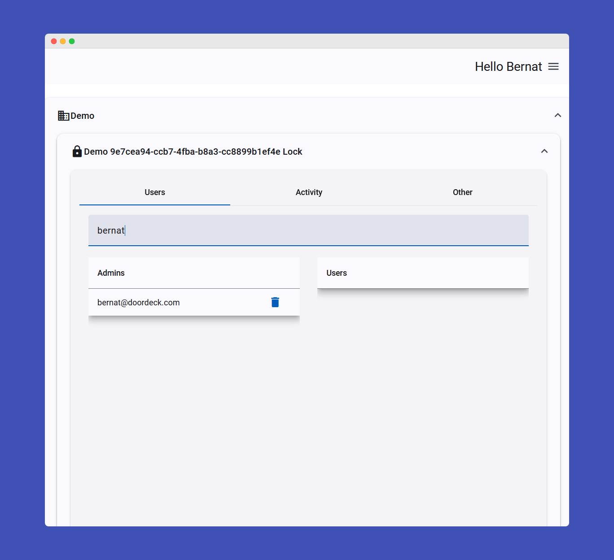

# Samples

Below are the available samples and functionalities for different platforms.

import Tabs from '@theme/Tabs';
import TabItem from '@theme/TabItem';

<Tabs>
<TabItem value="jvm" label="JVM">

</TabItem>
<TabItem value="android" label="Android">

</TabItem>
<TabItem value="swift" label="Swift">

</TabItem>
<TabItem value="js" label="JavaScript">

In JavaScript, we provide a sample built with Angular demonstrating how the SDK can be integrated into a web application.

#### Functionalities Included:
* User login
* Register ephemeral key with secondary authentication
* List sites
* List locks for a site
* List users for a lock
* List lock activity
* Share a lock
* Revoke access to a lock
* Unlock a lock
* Update user display name
* Update user password
* Logout

#### Sample Screenshots:
| Login Screen                                     |
|--------------------------------------------------|
|  |

| Dashboard                                                |
|----------------------------------------------------------|
|  |

| Revoke Access                                                    |
|------------------------------------------------------------------|
|  |

| Activity Log                                           |
|--------------------------------------------------------|
|  |

| Share Lock                                                 |
|------------------------------------------------------------|
|  |

</TabItem>
<TabItem value="csharp" label="C#">

In C#, we provide a sample build with **WPF** demonstrating how the SDK can be integrated into a desktop application.

#### Functionalities Included:
* User login
* Register ephemeral key with secondary authentication
* List sites
* List locks for a site
* List users for a lock
* List lock activity
* Share a lock
* Revoke access to a lock
* Unlock a lock
* Update user display name
* Update user password
* Logout

#### Sample Screenshots:
| Login Screen                                 |
|----------------------------------------------|
|  |

| Dashboard                                            |
|------------------------------------------------------|
|  |

| Revoke Access                                                |
|--------------------------------------------------------------|
|  |

| Activity Log                                       |
|----------------------------------------------------|
|  |

| Share Lock                                             |
|--------------------------------------------------------|
|  |

</TabItem>
<TabItem value="python" label="Python">

</TabItem>
</Tabs>
